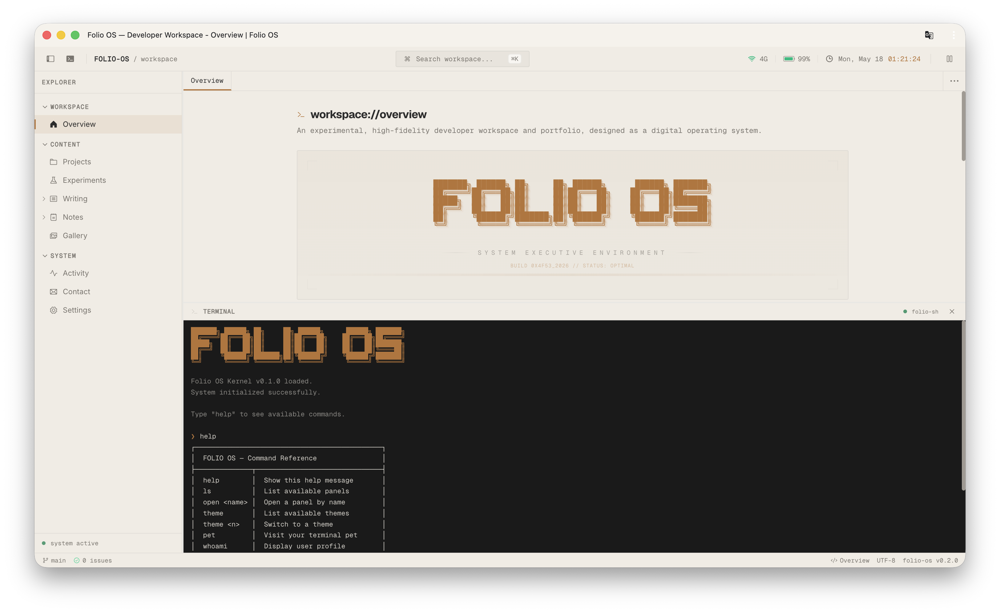

<div align="center">
  
  <h1>Folio OS</h1>
  <p><strong>🖥️ 一个将博客与知识库装进 IDE 里的复古操作环境</strong></p>

  <p>
    <b>简体中文</b> | <a href="README.md">English</a>
  </p>

  
</div>

<br />

## 💡 什么是 Folio OS？

**Folio OS** 启发自 VSCode 和复古操作系统，提供了一个独特的**沉浸式数字工作区**。它适用于个人博客、作品集、知识库和项目展示等，像在探索和操纵一个真实的软件环境一样来访问网站。

---

## ⚡ 特性

* **🖥️ 类 IDE 多面板操作**：支持侧边栏文件树、底部终端与主工作区的自由拉伸布局和全局命令面板。
* **📚 技术文档渲染**：深度集成 Fumadocs 技术文档引擎，侧边栏以文件树动态挂载 MDX 笔记，支持数学公式与代码块高亮。
* **🎨 内置主题切换**：内置 Graphite (石墨黑)、Linen (亚麻黄)、Vesper (深色琥珀)、Tokyo Night 等 8 套高质感配色，支持实时切换。
* **🔍 SEO 与 PWA 支持**：基于Next.js 动态路由的 SEO 优化，支持为每篇文章生成独立的页面；支持离线访问、应用内安装等。
* **🔋 顶部状态小部件**：实时在工具栏监测网络状态（ONLINE/OFFLINE）、设备剩余电量与 LiveClock 时钟。
* **⌨️ 内置模拟终端 (`folio-sh`)**：底部自带全功能 Shell，支持启动自检动画、历史指令（方向键 ↑/↓）与专属指令集（`neofetch`/`theme`/`whoami`）。
* **🐱 终端像素伴侣 `Pixel`**：可随时唤醒的电子猫。拥有饱食度/快乐度/能量衰减机制，支持 `pet feed`/`play`/`sleep` 趣味互动并展示 ASCII 情绪字符画。

---

## 🛠️ 技术栈

* **核心框架**：Next.js 16 (App Router) + React 19 + TypeScript
* **文档引擎**：Fumadocs
* **样式与动画**：Tailwind CSS 4.0 + Motion (Framer Motion)
* **状态管理**：Zustand 5

---

## 🚀 快速上手

### 1. 安装Node.js 和 pnpm
```bash
npm install -g pnpm
```

### 2. Clone 或 Fork 该项目
```bash
git clone https://github.com/42arch/folio-os
```

### 3. 安装依赖
```bash
pnpm install
```

### 4. 启动开发服务器
```bash
pnpm dev
```
在浏览器中打开 [http://localhost:3000](http://localhost:3000) 即可探索您的数字工作区。

### 5. 添加自己的文档（或者修改代码，根据需求来定制自己的网站）
* **文档存放位置**：
  * **技术文章**：放入 `content/writing/` 下的 `.md` 或 `.mdx` 文件。
  * **随笔笔记**：放入 `content/notes/` 下的 `.md` 或 `.mdx` 文件。
* **文件头部模板** (Frontmatter)：
  ```markdown
  ---
  title: 我的第一篇文档
  description: 简短描述
  date: 2026-05-18
  tags: ["标签一", "标签二"]
  category: "类别"
  ---
  ```

### 6. 生产构建
```bash
pnpm build
pnpm start
```

### 7. 一键部署
* 本项目完全兼容 **Vercel**、**Netlify**、**Cloudflare Pages** 等现代托管平台。
* **推荐使用 Vercel**：将您 Fork 后的仓库导入 Vercel，平台会自动识别 Next.js 并完成最优配置。点击 **Deploy** 即可上线访问！

---

## 📄 许可证

MIT
